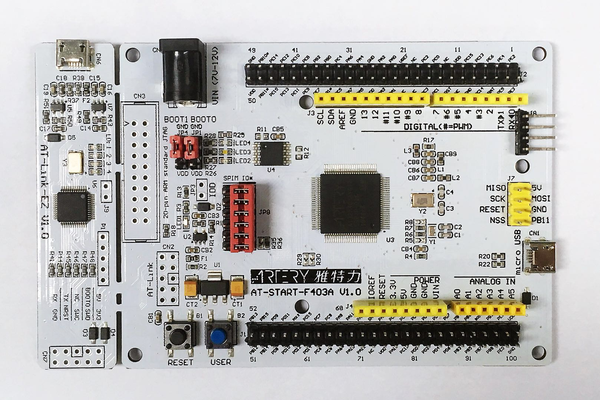

# FCTC-Air based on AT32F403A AT-START 


## 开发板 BSP 简介



AT32F403A AT-START是雅特力推出的一款AT32F403A系列的评估板，其搭载的MCU主要资源参数如下：

| 硬件      | 描述          |
| --------- | ------------- |
| 芯片型号  | AT32F403AVGT7 |
| CPU       | ARM Cortex M4 |
| 主频      | 240M          |
| 片内SRAM  | 96K可扩展224K |
| 片内FLASH | 1024K         |

## 编译说明

AT32F403A-START板级包支持MDK4﹑MDK5﹑IAR开发环境和GCC编译器，以下是具体版本信息：

| IDE/编译器 | 已测试版本                   |
| ---------- | ---------------------------- |
| MDK4       | MDK4.74                      |
| MDK5       | MDK523                       |
| IAR        | IAR8.20                      |
| GCC        | GCC 5.4.1 20160919 (release) |

## 板载资源

- MCU：AT32F403AVGT7，主频 240MHz，1024KB FLASH ，96KB可扩展到224KB RAM
- 常用外设
  - LED：3个，（红色PD13、白色PD14、绿色PD15）
  - 按键：1个，KEY_USER（兼具唤醒功能，PA0)
- 常用接口：插针串口J8
- 调试接口，JLINK、板载的 AT-LINK SWD 下载

## 外设支持

本 BSP 目前对外设驱动的支持情况如下：

| 驱动      | 支持情况 |            备注            |
| --------- | -------- | :------------------------: |
| UART      | 支持     | USART1/2/3                 |
| GPIO      | 支持     | PA0...PF7                  |
| IIC       | 支持     | GPIO模拟I2C                |
| SPI       | 支持     | SPI1/2                     |
| ADC       | 支持     | ADC1/2                     |
| PWM       | 支持     | TMR1/2                     |
| HWTIMER   | 支持     | TMR3/4/5                   |
| SDIO      | 支持     | SDIO1                      |
| WDT       | 支持     |                            |

### IO在板级支持包中的映射情况

| IO号 | 板级包中的定义 |
| ---- | -------------- |
| PD13 | LED2           |
| PD14 | LED3           |
| PD15 | LED4           |
| PA9  | USART1_TX      |
| PA10 | USART1_RX      |
| PA2  | USART2_TX      |
| PA3  | USART2_RX      |
| PB10 | USART3_TX      |
| PB11 | USART3_RX      |
| PA4  | SPI1_NSS       |
| PA5  | SPI1_SCK       |
| PA6  | SPI1_MISO      |
| PA7  | SPI1_MOSI      |
| PB12 | SPI2_NSS       |
| PB13 | SPI2_SCK       |
| PB14 | SPI2_MISO      |
| PB15 | SPI2_MOSI      |
| PB6  | I2C1_SCL       |
| PB7  | I2C1_SDA       |
| PC8  | SDIO1_D0       |
| PC9  | SDIO1_D1       |
| PC10 | SDIO1_D2       |
| PC11 | SDIO1_D3       |
| PC12 | SDIO1_CK       |
| PD2  | SDIO1_CMD      |
| PA8  | PWM_TMR1_CH1   |
| PA11 | PWM_TMR1_CH4   |
| PA0  | PWM_TMR2_CH1   |
| PA1  | PWM_TMR2_CH2   |
| PC0  | ADC1/2_IN10    |
| PC1  | ADC1/2_IN11    |
| PC2  | ADC1/2_IN12    |
| PC3  | ADC1/2_IN13    |
| PC4  | ADC1/2_IN14    |
| PC5  | ADC1/2_IN15    |

## 使用说明

    本章节是为刚接触 RT-Thread 的新手准备的使用说明，遵循简单的步骤即可将 RT-Thread 操作系统运行在该开发板上，看到实验效果 。

### 快速上手

本 BSP 为开发者提供 MDK4、MDK5 和 IAR 工程，并且支持 GCC 开发环境。下面以 MDK5 开发环境为例，介绍如何将系统运行起来。

#### 硬件连接

使用数据线连接开发板到 PC，打开电源开关。

#### 编译下载

双击 project.uvprojx 文件，打开 MDK5 工程，编译并下载程序到开发板。

> 工程默认配置使用 JLink 下载程序，在通过 JLink 连接开发板的基础上，点击下载按钮即可下载程序到开发板

#### 运行结果

下载程序成功之后，系统会自动运行，观察开发板上 LED 的运行效果，LED2/3/4 会周期性闪烁。

连接开发板对应串口到 PC , 在终端工具里打开相应的串口（115200-8-1-N），复位设备后，在串口上可以看到 RT-Thread 的输出信息:

```bash
 \ | /
- RT -     Thread Operating System
 / | \     4.0.3 build Mar  9 2020
 2006 - 2020 Copyright by rt-thread team
msh />
```


## 硬件连接

| 模块引脚      | AT32 引脚        | Arduino 接口 | 备注                     |
| ------------- | ---------------- | ------------ | ------------------------ |
| **DHT22**     |                  |              |                          |
| D~OUT~        | PB3（19）        | D3           | 温湿度值输出（数字信号） |
| **GP2Y10**    |                  |              |                          |
| I~LED~        | PA10（10）       | D2           | 红外二极管信号           |
| A~OUT~        | PA4（4）         | A2           | 模拟输出（ADC12_IN4）    |
| **SGP30**     |                  |              |                          |
| SCL           | PB8（24）        | D15（SCL）   | I2C 时钟信号（I2C1_SCL） |
| SDA           | PB9（25）        | D14（SDA）   | I2C 数据信号（I2C1_SDA） |
| **BC28 TE-B** |                  |              |                          |
| MCU_TX        | PA2（USART2_TX） | D1           | 连接 BC28 主串口 RX      |
| MCU_RX        | PA3（USART2_RX） | D0           | 连接 BC28 主串口 TX      |
| ADC0          | PA1（1）         | A1           | 模数转换接口             |
| POWER_EN      | PA0（0）         | A0           | DC-DC 使能（BC28无效）   |
| RESET_N       | PA5（5）         | D13          | 复位（高电平有效？）     |


## 注意事项

可在雅特力官方网站进行所需资料下载，如Keil_v5/Keil_v4/IAR等pack安装包和AT-START开发板原理图等（www.arterytek.com）


## 联系人信息

维护人:

- [luhuadong](https://github.com/luhuadong) 